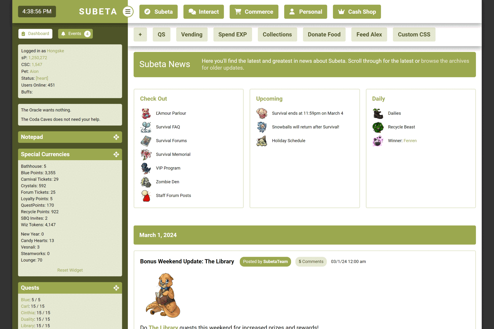

[Home](https://hongske.github.io/subeta/) » [CustomCSS](https://hongske.github.io/subeta/custom-css) » **Modernised**

<!-- NEW SECTION ------------------------------------------------------------------------------------------------------>
 
<!-- NEW SECTION ------------------------------------------------------------------------------------------------------>

<!-- NEW SECTION ------------------------------------------------------------------------------------------------------>
 
<!-- NEW SECTION ------------------------------------------------------------------------------------------------------>

## ⭐ Installing the theme
To install the theme, please use the **[✨theme code generator✨](theme_code_generator.html)** to pick your preferred options and to generate the code.

<!-- NEW SECTION ------------------------------------------------------------------------------------------------------>
 
<!-- NEW SECTION ------------------------------------------------------------------------------------------------------>

## ⭐ Features & screenshots
- Features without an icon are for both desktop and mobile screens
- 👁‍🗨 means this feature is only for mobile
- 📷 means this is a link to a screenshot

📌 List of general layout changes

- Modernised the layout
  - Unified various design elements (banners, menu's, buttons, ...)
  - Improved readability of various bits and bobs
  - Upated icons (using FontAwesome 6.5.1)
  - Gave the total layout a max-width, so that it doesn't look so stretched on bigger screens
  - Added mobile version for smartphone users
- Modified main menu-bar • [📷 screenshot desktop](screenshots/menu--desktop.png) • [📷 screenshot mobile](screenshots/menu--mobile.png)
  - Fixed the main menu-bar to the top of the page, so that it's always in view (even if you scroll down)
  - Reversed the order of menu-items
  - Added icons to the menu-items
  - Added options `--number-of-menu-pets`, `--number-of-menu-friends` and `--number-of-menu-shops` so you can chose how many subitems you want to see for these dropdowns at once
  - 👁‍🗨 Modified menu dropdowns so that they're shown in 2 columns
  - 👁‍🗨 Removed text in the menu-items, so that only icons are shown
  - 👁‍🗨 Removed nested dropdowns (e.g. Freinds, Pets, ...)
- Modified bookmarks
  - Fixed the bookmarks-bar to the top of the page instead of the side, underneath the main menu-bar
  - 👁‍🗨 Removed bookmarks
- Modified sidebar
  - Made sidebar wider
  - Moved the time-display to the left and made it bigger
  - Modified the sidebar-toggle so that it's an icon instead of text
  - Restyled sidebar-widgets:
    - Modified sidebar-widgets so they can only be dragged via their icon (instead of by the whole header or widget)
    - Restyled "Active Pet" • [📷 screenshot](screenshots/sidebar/widget__activepet.png)
    - Restyled "Battle Pet"
      - Added option `--display-sidebar-battlepet-buttons` to hide buttons • [📷 screenshot](screenshots/sidebar/widget__battlepet-2.png)
      - Emphasised the training center status • [📷 screenshot](screenshots/sidebar/widget__battlepet-1.gif)
    - Restyled "Events"
    - Restyled "Friend Feed" • [📷 screenshot](screenshots/sidebar/widget__friendfeed.png)
    <!-- TODO - Restyled "Melody's Cottage" -->
    - Restyled "Navigation" • [📷 screenshot](screenshots/sidebar/widget__navigation.png)
    - Restyled "Special Currencies" • [📷 screenshot](screenshots/sidebar/widget__currencies.png)
      - Added option `--display-sidebar-currency-headers` to hide the headers (Active, Seasonal and Events)
    - Restyled "Shop Search" and "Search Subeta" • [📷 screenshot](screenshots/sidebar/widget__search.png)
    - Restyled "Subscriptions" • [📷 screenshot](screenshots/sidebar/widget__subscriptions.png)
- Modified item-views
  - Modified the item orientation so that item-images and -text are shown next to each other (instead of below each other)
  - Modified styling for wishlist-items so that they're more obvious • [📷 screenshot](screenshots/wishlist.gif)
  - Removed styling for wishlist-items in forum-images and signatures
  - Restyled the popup you get when you hover over items • [📷 screenshot](screenshots/hover_item.png)
  - 👁‍🗨 Moved the item-hovers so that they're always centered on the page
  - 👁‍🗨 Resized item-images so they take up less space
  - 👁‍🗨 Removed options to add and remove from wishlist (as it's hard to get right on mobile)
- Restyled the popup you get when you hover over users • [📷 screenshot](screenshots/hover_user.png)
- Added other general options
  - Added option `--display-floating-item` to hide floating items (like flowers during Survival)
  - Added option `--display-hustler` to hide Hustler-banner
  - Added options to modify theme colours

<!--------------------------------------------------------------------------------------------------------------------->

📌 List of page changes

- Restyled **Gifts Center**
  - Removed NPC-image
  - Restyled **[Your Gifts](https://subeta.net/explore/gifts.php/gifts)**
  - Restyled **[Sent History](https://subeta.net/explore/gifts.php/sent)**
  - Restyled **Send a Gift » Gift Page**
- Restyled **Vending** • [📷 screenshot desktop](screenshots/pages/vending--desktop.png) • [📷 screenshot mobile](screenshots/pages/vending--mobile.png)
  - Modified the items so that they're easier to read
  - 👁‍🗨 Changed the image of the vending machine to a big red button
- Restyled **Quests** • [📷 screenshot desktop](screenshots/pages/quests--desktop.png) • [📷 screenshot mobile](screenshots/pages/quests--mobile.png)
  - 👁‍🗨 Removed NPC-images
  - Restyled **[main quests](https://subeta.net/quests.php/wizard)**
    - Added option `--display-quest-intro` to hide intro-text
    - Moved the "Quit Quest" button to be further away from "Finish Quest", so you don't click it accidentally (only for desktop!)
  - Restyled **[wizard exchange](https://subeta.net/explore/wizard_exchange.php)**
  - Restyled **[Major Drills' quests](https://subeta.net/explore/major_drills.php)**
  - Restyled **[Shinwa's quests](https://subeta.net/explore/goddess.php)**
- Restyled **[Your Events](https://subeta.net/events.php)** • [📷 screenshot desktop](screenshots/pages/events--desktop.png) • [📷 screenshot mobile](screenshots/pages/events--mobile.png)

<!--------------------------------------------------------------------------------------------------------------------->

📌 List of page changes [Cash Shop]

- Restyled **[Home](https://subeta.net/cs/index.php)** • [📷 screenshot desktop](screenshots/pages/cashshop__home--desktop.png) • [📷 screenshot mobile](screenshots/pages/cashshop__home--mobile.png)
- Restyled **[Gold Accounts](https://subeta.net/ss.php/goldaccount)** • [📷 screenshot desktop](screenshots/pages/cashshop__gold_account--desktop.png) • [📷 screenshot mobile](screenshots/pages/cashshop__gold_account--mobile.png)
- Restyled **[Items](https://subeta.net/ss.php/cashshop)** • [📷 screenshot desktop](screenshots/pages/cashshop__items--desktop.png) • [📷 screenshot mobile](screenshots/pages/cashshop__items--mobile.png)
- Restyled **[Boutique](https://subeta.net/cs/boutique.php)** • [📷 screenshot desktop](screenshots/pages/cashshop__boutique--desktop.gif) • [📷 screenshot mobile](screenshots/pages/cashshop__boutique--mobile.gif)
- Restyled **[Bonus Items](https://subeta.net/ss.php/csitems)** • [📷 screenshot desktop](screenshots/pages/cashshop__bonus_items--desktop.png) • [📷 screenshot mobile](screenshots/pages/cashshop__bonus_items--mobile.png)
- Restyled **[Neela](https://subeta.net/ss.php/neela)** • [📷 screenshot desktop](screenshots/pages/cashshop__neela--desktop.png) • [📷 screenshot mobile](screenshots/pages/cashshop__neela--mobile.png)
- Restyled **[Trunks](https://subeta.net/cs/trunks.php)** • [📷 screenshot desktop](screenshots/pages/cashshop__costume_trunks--desktop.gif) • [📷 screenshot mobile](screenshots/pages/cashshop__costume_trunks--mobile.gif)
- Restyled **[Cart](https://subeta.net/cs/cart.php)** • [📷 screenshot desktop](screenshots/pages/cashshop__cart--desktop.png)
<!-- TODO - Restyled **[Chance](https://subeta.net/cs/chance.php)** • [📷 screenshot desktop](screenshots/pages) • [📷 screenshot mobile](screenshots/pages) -->
<!-- TODO - Restyled **[Billboards](https://subeta.net/billboards.php)** • [📷 screenshot desktop](screenshots/pages) • [📷 screenshot mobile](screenshots/pages) -->
<!-- TODO - Restyled **[Purchase Logs](https://subeta.net/cs/purchase_logs.php)** • [📷 screenshot desktop](screenshots/pages) • [📷 screenshot mobile](screenshots/pages) -->

<!--------------------------------------------------------------------------------------------------------------------->

📌 List of page changes [Commerce]

- Restyled **[Main Shops](https://subeta.net/shops.php)** • [📷 screenshot desktop](screenshots/pages/commerce__main_shops--desktop.png) • [📷 screenshot mobile](screenshots/pages/commerce__main_shops--mobile.png)
  - Restyled detail of shop • [📷 screenshot desktop](screenshots/pages/commerce__main_shops_detail--desktop.png) • [📷 screenshot mobile](screenshots/pages/commerce__main_shops_detail--mobile.png)
- Restyled **[Search Shops](https://subeta.net/user_shops.php/search)** • [📷 screenshot desktop](screenshots/pages/commerce__search_shops--desktop.png) • [📷 screenshot mobile](screenshots/pages/commerce__search_shops--mobile.png)
  - Restyled input for searching shops
  - Restyled search results
- Restyled **[Special Shops](https://subeta.net/ss.php)** • [📷 screenshot desktop](screenshots/pages/commerce__special_shops--desktop.png) • [📷 screenshot mobile](screenshots/pages/commerce__special_shops--mobile.png)
  - Restyled detail of shop • [📷 screenshot desktop](screenshots/pages/commerce__special_shops_detail--desktop.png) • [📷 screenshot mobile](screenshots/pages/commerce__special_shops_detail--mobile.png)
    - Restyled the items
    - Removed the sidebar with NPC-image, NPC name and buttons
  - Restyled **[Subeautique](https://subeta.net/explore/subeautique.php)** • [📷 screenshot desktop](screenshots/pages/commerce__special_shop__sbq--desktop.png) • [📷 screenshot mobile](screenshots/pages/commerce__special_shop__sbq--mobile.png)
    - Added option `--display-subeautique-intro` to hide the intro-text
    - 👁‍🗨 Removed NPC-image
    - Restyled **[Subeautique Clothing](https://subeta.net/explore/subeautique.php/shop)** • [📷 screenshot desktop](screenshots/pages/commerce__special_shop__sbq__clothing--desktop.png) • [📷 screenshot mobile](screenshots/pages/commerce__special_shop__sbq__clothing--mobile.png)
    - Restyled **[Subeautique Makeup](https://subeta.net/explore/subeautique.php/makeup)** • [📷 screenshot desktop](screenshots/pages/commerce__special_shop__sbq__makeup--desktop.png) • [📷 screenshot mobile](screenshots/pages/commerce__special_shop__subeautique__makeup--mobile.png)
- Restyled **[Your Shops](https://subeta.net/user_shops.php/mine)**
  - Restyled **Edit Items** • [📷 screenshot desktop](screenshots/pages/commerce__your_shops__edit_items--desktop.png) • [📷 screenshot mobile](screenshots/pages/commerce__your_shops__edit_items--mobile.png)
    - Added option `--display-yourshop-item-category` to hide categories (from the filters *and* items-list)
    - Removed Item ID from the items-list
  - Restyled **Quick Stock** • [📷 screenshot desktop](screenshots/pages/commerce__your_shops__quick_stock--desktop.png) • [📷 screenshot mobile](screenshots/pages/commerce__your_shops__quick_stock--mobile.png)
    - Replaced locations' text with icons
    - Added option `--display-yourshop-quickstock-delete` to hide delete-option completely
    - 👁‍🗨 Removed the delete-option
  - Restyled **Autopricer** • [📷 screenshot desktop](screenshots/pages/commerce__your_shops__autopricer--desktop.png) • [📷 screenshot mobile](screenshots/pages/commerce__your_shops__autopricer--mobile.png)
    - Removed info-text about new prices (lowest, average and no change)
    - Removed old price and average price columns from results table, so only lowest price is visible
    - Restyled pricing to emphasise whether a price has gone up or down
  - Restyled **Profits** • [📷 screenshot desktop](screenshots/pages/commerce__your_shops__profits--desktop.png) • [📷 screenshot mobile](screenshots/pages/commerce__your_shops__profits--mobile.png)
    - 👁‍🗨 Removed piggybank-images
  - Restyled **Sales History** • [📷 screenshot desktop](screenshots/pages/commerce__your_shops__sales_history--desktop.png) • [📷 screenshot mobile](screenshots/pages/commerce__your_shops__sales_history--mobile.png)
    - Added option `--display-yourshop-sales-info` to hide info-text
- Restyled **User Shops** • [📷 screenshot desktop](screenshots/pages/commerce__user_shop--desktop.png) • [📷 screenshot mobile](screenshots/pages/commerce__user_shop--mobile.png)

<!--------------------------------------------------------------------------------------------------------------------->

📌 List of page changes [Interact]

- Restyled **[Forums](https://subeta.net/forums.php)**
  - Restyled **[Forum Home](https://subeta.net/forums.php)** • [📷 screenshot desktop](screenshots/pages/interact__forums__home--desktop.png) • [📷 screenshot mobile](screenshots/pages/interact__forums__home--mobile.png)
    - Added option `--display-forum-pulse` to completely hide forum-pulse
    - Added option `--number-of-boards` to change the number of boards per row
    - Replaced collapse-text with an icon (same icon as for sidebar-widgets)
    - Modified order of forum-details so that the list of subforums is last
    - Restyled **Subforums** • [📷 screenshot desktop](screenshots/pages/interact__forums__home__subforum--desktop.png) • [📷 screenshot mobile](screenshots/pages/interact__forums__home__subforum--mobile.png)
      - Topics with unread posts have their text in bold
      - Topics with unread posts also have a bullhorn icon, which you can click to go the most recent unread post
      - Topics you have replied on have their text in black
      - Topics you haven't replied on have their text in your theme's accent colour
    - Restyled **Topics** • [📷 screenshot desktop](screenshots/pages/interact__forums__home__topic--desktop.png) • [📷 screenshot mobile](screenshots/pages/interact__forums__home__topic--mobile.png)
      - Removed the ping- and report-buttons on own posts
      - Removed leashed pets
      - Added option `--display-forum-avatar` to show the avatar again (in the form of a headshot)
      - Added option `--display-forum-post-report` to hide the report-button on posts
      - Added option `--display-forum-post-image` to hide post images
      - Added option `--display-forum-post-signature` to hide signatures
      - 👁‍🗨 Removed forum images and signatures
      - Fixed reply-form to the bottom of the page, so that it's always visible
      - Fixed the locked-message for locked topics to the bottom of the page, so that it's always visible
      - Fixed the lock-icon on the locked-message for locked topics, so it's less ginormous
      - Removed the ping-options from the reply form
      - 👁‍🗨 Removed the formatting-options from the reply form
      - Restyled Shared Outfits • [📷 screenshot desktop](screenshots/pages/interact__forums__shared_outfits--desktop.png) • [📷 screenshot mobile](screenshots/pages/interact__forums__shared_outfits--mobile.png)
  - Restyled **[Subscribed Threads](https://subeta.net/forums.php/subscriptions)** • [📷 screenshot desktop](screenshots/pages/interact__forums__subscribed_threads--desktop.png) • [📷 screenshot mobile](screenshots/pages/interact__forums__subscribed_threads--mobile.png)
    - Added option `--display-forum-subscribed-intro` to hide the intro-text
  - Restyled **[Recent Topics](https://subeta.net/forums.php/recent/topics)** • [📷 screenshot desktop](screenshots/pages/interact__forums__recent_topics--desktop.png) • [📷 screenshot mobile](screenshots/pages/interact__forums__recent_topics--mobile.png)
  - Restyled **[Recent Posts](https://subeta.net/forums.php/recent/posts)** • [📷 screenshot desktop](screenshots/pages/interact__forums__recent_posts--desktop.png) • [📷 screenshot mobile](screenshots/pages/interact__forums__recent_posts--mobile.png)
  - Restyled **[Groups](https://subeta.net/forums.php/groups/)** • [📷 screenshot desktop](screenshots/pages/interact__forums__groups--desktop.png) • [📷 screenshot mobile](screenshots/pages/interact__forums__groups--mobile.png)
    - Added option `--display-forum-group-intro` to hide the intro-text
    - Restyled **Group Detail** • [📷 screenshot desktop](screenshots/pages/interact__forums__groups__detail--desktop.png) • [📷 screenshot mobile](screenshots/pages/interact__forums__groups__detail--mobile.png)
    - Restyled **Group Members** • [📷 screenshot desktop](screenshots/pages/interact__forums__groups__members--desktop.png) • [📷 screenshot mobile](screenshots/pages/interact__forums__groups__members--mobile.png)
  - Restyled **[Admin Posts](https://subeta.net/forums.php/admin_posts)** • [📷 screenshot desktop](screenshots/pages/interact__forums__admin_posts--desktop.png) • [📷 screenshot mobile](screenshots/pages/interact__forums__admin_posts--mobile.png)
- Restyled **[sMail](https://subeta.net/mail.php)**
  - Restyled **[Inbox](https://subeta.net/mail.php?folderid=1)** • [📷 screenshot desktop](screenshots/pages/interact__smail__inbox--desktop.png) • [📷 screenshot mobile](screenshots/pages/interact__smail__inbox--mobile.png)
  - Restyled **[Outbox](https://subeta.net/mail.php?folderid=20)** • [📷 screenshot desktop](screenshots/pages/interact__smail__outbox--desktop.png) • [📷 screenshot mobile](screenshots/pages/interact__smail__outbox--mobile.png)
  - Restyled **[New Message](https://subeta.net/mail.php?act=new)** • [📷 screenshot desktop](screenshots/pages/interact__smail__new_message--desktop.png) • [📷 screenshot mobile](screenshots/pages/interact__smail__new_message--mobile.png)
  - Restyled **Reply** • [📷 screenshot desktop](screenshots/pages/interact__smail__reply--desktop.gif) • [📷 screenshot mobile](screenshots/pages/interact__smail__reply--mobile.gif)
  - Restyled **[Preferences](https://subeta.net/mail.php?act=prefs)** • [📷 screenshot desktop](screenshots/pages/interact__smail__preferences--desktop.png) • [📷 screenshot mobile](screenshots/pages/interact__smail__preferences--mobile.png)
  - Restyled **[Edit Folders](https://subeta.net/mail.php?act=editfolders)** • [📷 screenshot desktop](screenshots/pages/interact__smail__edit_folders--desktop.png) • [📷 screenshot mobile](screenshots/pages/interact__smail__edit_folders--mobile.png)

<!--------------------------------------------------------------------------------------------------------------------->

📌 List of page changes [Personal]

- Restyled **[Account Search](https://subeta.net/isearch.php)** • [📷 screenshot desktop](screenshots/pages/personal__account_search--desktop.png) • [📷 screenshot mobile](screenshots/pages/personal__account_search--mobile.png)
- Restyled **[Achievements](https://subeta.net/achievements.php)** • [📷 screenshot desktop](screenshots/pages/personal__achievements--desktop.png) • [📷 screenshot mobile](screenshots/pages/personal__achievements--mobile.png)
  - Removed achievement-counter at the top of the page
  - Resized the sidebar
  - 👁‍🗨 Removed subcategories
- Restyled **Comments** • [📷 screenshot desktop](screenshots/pages/personal__comments--desktop.png) • [📷 screenshot mobile](screenshots/pages/personal__comments--mobile.png)
- Restyled **[Inventory](https://subeta.net/inventory.php)** • [📷 screenshot desktop](screenshots/pages/personal__inventory--desktop.png) • [📷 screenshot mobile](screenshots/pages/personal__inventory--mobile.png)
  - Added option `--display-inventory-locked` to hide the info-text about locked items
  - Replaced the lock-images with colour-coded icons
  - Restyled the item detail page • [📷 screenshot desktop](screenshots/pages/personal__inventory__detail--desktop.png) • [📷 screenshot mobile](screenshots/pages/personal__inventory__detail--mobile.png)
    - Added option `--display-inventory-sendfriend` to hide the "Send to a Friend" link
    - Added option `--display-inventory-sendfriend-mobile` to hide the "Send to a Friend" link on an item's detail page in the inventory, but **only on mobile**
- Restyled **[Pets](https://subeta.net/pets.php)** • [📷 screenshot desktop](screenshots/pages/personal__pets--desktop.png) • [📷 screenshot mobile](screenshots/pages/personal__pets--mobile.png)
  - Modified the pet-dropdown with options so that it's always shown
  - Added options to hide individual links in the pet-dropdown
  - Added options to change the font-weight of individual links in the pet-dropdown
  - Added option `--number-of-pets` to change the number of pets per row
  - Added icons for hunger and happiness
  - Modified icon for likes
  - Restyled **[Job Agency](https://subeta.net/explore/job_agency.php)** • [📷 screenshot desktop](screenshots/pages/personal__pets__job_agency--desktop.png) • [📷 screenshot mobile](screenshots/pages/personal__pets__job_agency--mobile.png)
    - Added option `--display-pets-job-intro` to hide the intro-text
    - Added option `--number-of-pets-job` to change the number of pets per row
    - Restyled **Pet Overview** • [📷 screenshot desktop](screenshots/pages/personal__pets__job_agency__pet--desktop.png) • [📷 screenshot mobile](screenshots/pages/personal__pets__job_agency__pet--mobile.png)
    - Restyled **Job Listings** • [📷 screenshot desktop](screenshots/pages/personal__pets__job_agency__job_listings--desktop.png) • [📷 screenshot mobile](screenshots/pages/personal__pets__job_agency__job_listings--mobile.png)
- Restyled **Vault**
  - Removed "Your Vaults"-text from the menu
  - Restyled **[Currency Storage](https://subeta.net/explore/vaults.php?vault=currency)** • [📷 screenshot desktop](screenshots/pages/personal__vaults__currency--desktop.png) • [📷 screenshot mobile](screenshots/pages/personal__vaults__currency--mobile.png)
  - Restyled **[Item Storage](https://subeta.net/explore/vaults.php?vault=item)** • [📷 screenshot desktop](screenshots/pages/personal__vaults__items--desktop.png) • [📷 screenshot mobile](screenshots/pages/personal__vaults__items--mobile.png)
    - Removed flavor-image and -text
- Restyled **[Wishlist](https://subeta.net/wishlists.php)** • [📷 screenshot desktop](screenshots/pages/personal__wishlist--desktop.png) • [📷 screenshot mobile](screenshots/pages/personal__wishlist--mobile.png)
  - Restyled the wishlist detail page • [📷 screenshot desktop](screenshots/pages/personal__wishlist__detail--desktop.png) • [📷 screenshot mobile](screenshots/pages/personal__wishlist__detail--mobile.png)
- Restyled **[Dashboard](https://subeta.net/preferences.php)** • [📷 screenshot desktop](screenshots/pages/personal__dashboard--desktop.png) • [📷 screenshot mobile](screenshots/pages/personal__dashboard--mobile.png)
  - Restyled **[CustomCSS](https://subeta.net/preferences.php?act=customcss)** • [📷 screenshot desktop](screenshots/pages/personal__dashboard__customcss--desktop.png) • [📷 screenshot mobile](screenshots/pages/personal__dashboard__customcss--mobile.png)
  - Restyled **[Profile](https://subeta.net/preferences.php?act=profile)** • [📷 screenshot desktop](screenshots/pages/personal__dashboard__profile--desktop.png) • [📷 screenshot mobile](screenshots/pages/personal__dashboard__profile--mobile.png)
  - Restyled **[Widgets](https://subeta.net/preferences.php?act=sidebar)** • [📷 screenshot desktop](screenshots/pages/personal__dashboard__widgets--desktop.png) • [📷 screenshot mobile](screenshots/pages/personal__dashboard__widgets--mobile.png)
  - Restyled **[Bookmarks](https://subeta.net/preferences.php?act=bookmarks)** • [📷 screenshot](screenshots/pages/personal__dashboard__bookmarks--desktop.png)
  - Restyled **[Preferences](https://subeta.net/preferences.php?act=prefs)** • [📷 screenshot desktop](screenshots/pages/personal__dashboard__preferences--desktop.png) • [📷 screenshot mobile](screenshots/pages/personal__dashboard__preferences--mobile.png)
  - Restyled **[Buffs](https://subeta.net/preferences.php?act=buffs)** • [📷 screenshot desktop](screenshots/pages/personal__dashboard__buffs--desktop.png) • [📷 screenshot mobile](screenshots/pages/personal__dashboard__buffs--mobile.png)

<!--------------------------------------------------------------------------------------------------------------------->

📌 List of page changes [Subeta]

- **[Explore » Coda Caves](https://subeta.net/explore/codacaves.php)**
  - 👁‍🗨 Removed NPC-image
- **[Explore » Darkside » Ultimate Pet Zapper](https://subeta.net/explore/zapper.php)** • [📷 screenshot desktop](screenshots/pages/subeta__explore__darkside__pet_zapper--desktop.png) • [📷 screenshot mobile](screenshots/pages/subeta__explore__darkside__pet_zapper--mobile.png)
  - Removed NPC-image
  - Added option `--display-pet-zapper-warning` to hide warning-text
  - Added option `--display-pet-zapper-intro` to hide intro-text
  - Added option `--display-pet-zapper-adoption` to hide adoption-text
- **[Explore » Delphi » Carnival » Ruffie Raffle](https://subeta.net/explore/carnival/ruffie_raffle.php)** • [📷 screenshot desktop](screenshots/pages/subeta__explore__delphi__ruffie_raffle--desktop.gif) • [📷 screenshot mobile](screenshots/pages/subeta__explore__delphi__ruffie_raffle--mobile.gif)
  - 👁‍🗨 Removed NPC-image
- **[Explore » Galaxan Wastes » The Rift](https://subeta.net/explore/rift/)** • [📷 screenshot desktop](screenshots/pages/subeta__explore__galaxan_wastes__rift--desktop.png) • [📷 screenshot mobile](screenshots/pages/subeta__explore__galaxan_wastes__rift--mobile.png)
  - 👁‍🗨 Removed image
- **[Explore » Shadowglen » Crypts](https://subeta.net/explore/crypts.php)**
  - Made the crypts-map-images scrollable on mobile
  - 👁‍🗨 Removed NPC-image
- **[Explore » Shadowglen » Underground » Underground Fishing](https://subeta.net/explore/underground/fishing.php)**
  - 👁‍🗨 Removed NPC-image
- **[Explore » Shengui Guo » Floating Market](https://subeta.net/explore/shengui_guo/river.php)**
  - 👁‍🗨 Removed NPC-image + intro-text
  - Restyled **[Dara's Darlings](https://subeta.net/explore/shengui_guo/dara.php)**  [📷 screenshot desktop](screenshots/pages/subeta__explore__shengui_guo__dara--desktop.png) • [📷 screenshot mobile](screenshots/pages/subeta__explore__shengui_guo__dara--mobile.png)
    - Added option `--display-shenguiguo-dara-intro` to hide Dara's intro-text
  - Restyled **[Fine Fabrics](https://subeta.net/explore/shengui_guo/clothing.php)** • [📷 screenshot desktop](screenshots/pages/subeta__explore__shengui_guo__jogoh--desktop.png) • [📷 screenshot mobile](screenshots/pages/subeta__explore__shengui_guo__jogoh--mobile.png)
    - Added option `--display-shenguiguo-jogoh-intro` to hide Jogoh's intro-text
  - Restyled **[Fresh and Flavorful](https://subeta.net/explore/shengui_guo/ujin.php)** • [📷 screenshot desktop](screenshots/pages/subeta__explore__shengui_guo__ujin--desktop.png) • [📷 screenshot mobile](screenshots/pages/subeta__explore__shengui_guo__ujin--mobile.png)
    - Added option `--display-shenguiguo-ujin-intro` to hide Ujin's intro-text
- **Games** • [📷 screenshot desktop](screenshots/pages/subeta__games--desktop.png) • [📷 screenshot mobile](screenshots/pages/subeta__games--mobile.png)
  - Restyled the games overview-page
- **Games » Battle**
  - Removed images in the battle-menu
  - Added options to hide individual links in the battle-menu
  - Added options to change the font-weight of individual links in the battle-menu
  - Restyled the warning for on-going battles
  - Restyled **[Battle » Challenge Opponent](https://subeta.net/games/battle/challenge.php)** • [📷 screenshot desktop](screenshots/pages/subeta__games__battle__challenge_opponent--desktop.png) • [📷 screenshot mobile](screenshots/pages/subeta__games__battle__challenge_opponent--mobile.png)
    - Added option `--number-of-challengers` to change the number of challengers per row
    - Added option `--display-battle-opponent-weapons` to hide the "Choose Weapons" button
    - Restyled the fight-screen • [📷 screenshot desktop](screenshots/pages/subeta__games__battle__challenge_fight--desktop.gif) • [📷 screenshot mobile](screenshots/pages/subeta__games__battle__challenge_fight--mobile.gif)
  - Restyled **[Armory](https://subeta.net/games/battle/weapons.php)** • [📷 screenshot desktop](screenshots/pages/subeta__games__battle__armory--desktop.png) • [📷 screenshot mobile](screenshots/pages/subeta__games__battle__armory--mobile.png)
    - Restyled **Armory » Edit Set** • [📷 screenshot desktop](screenshots/pages/subeta__games__battle__armory_edit--desktop.png) • [📷 screenshot mobile](screenshots/pages/subeta__games__battle__armory_edit--mobile.png)
  - Restyled **[Battle » Statistics](https://subeta.net/games/battle/stats.php)** • [📷 screenshot desktop](screenshots/pages/subeta__games__battle__statistics--desktop.gif)
  - Restyled **[Spend Exp](https://subeta.net/games/battle/exp.php)** • [📷 screenshot desktop](screenshots/pages/subeta__games__battle__spend_exp--desktop.png) • [📷 screenshot mobile](screenshots/pages/subeta__games__battle__spend_exp--mobile.png)
    - Added option `--display-battle-exp-intro` to hide the intro-text
    - Added option `--number-of-pets-spendexp` to change the number of pets per row
    - Restyled **Spend Exp » Pet** • [📷 screenshot desktop](screenshots/pages/subeta__games__battle__spend_exp_detail--desktop.png)
      - Added option `--display-battle-exp-pet-intro` to hide the intro-text
  - Restyled **[Battle » Healer](https://subeta.net/explore/healer.php)** • [📷 screenshot desktop](screenshots/pages/subeta__games__battle__healer--desktop.png) • [📷 screenshot mobile](screenshots/pages/subeta__games__battle__healer--mobile.png)
    - Added option `--number-of-pets-healer` to change the number of pets per row
  - Restyled **[Battle » Battle Quests](https://subeta.net/games/battle/quest.php)** • [📷 screenshot desktop](screenshots/pages/subeta__games__battle__battle_quest--desktop.gif) • [📷 screenshot mobile](screenshots/pages/subeta__games__battle__battle_quest--mobile.gif)
  - Restyled **[Training Center](https://subeta.net/explore/train.php)** • [📷 screenshot desktop](screenshots/pages/subeta__games__battle__training--desktop.gif) • [📷 screenshot mobile](screenshots/pages/subeta__games__battle__training--mobile.gif)
    - Removed NPC-image
    - Added option `--display-battle-training-intro` to hide intro-text
    - Added option `--display-battle-training-warning` to hide warning about level cap and autotraining
    - Added option `--display-battle-training-auto` to hide autotraining buttons
    - Added option `--number-of-pets-training` to change the number of pets per row
- **[Games » Chance » Fishing](https://subeta.net/games/fishing.php)**
  - 👁‍🗨 Removed NPC-image
- **[Games » Chance » Mindreader](https://subeta.net/games/mind_reader.php)**
  - 👁‍🗨 Removed NPC-image
  - Restyled items and removed their descriptions
- **[Games » Chance » Scratchcards](https://subeta.net/games/scratchcards.php)**
  - 👁‍🗨 Removed NPC-image
- **Games » Collections**
  - Restyled **Plushie**, **Trading Card**, **Beanbag**, **Pumpkin**, **Pastry** and **Tile** collections • [📷 screenshot desktop](screenshots/pages/subeta__games__collections--desktop.png) • [📷 screenshot mobile](screenshots/pages/subeta__games__collections--mobile.png)
  - Restyled **Sticker Album** collection • [📷 screenshot desktop](screenshots/pages/subeta__games__collections__stickers--desktop.png) • [📷 screenshot mobile](screenshots/pages/subeta__games__collections__stickers--mobile.png)
    - Added option `--display-stickers-unstack` to hide the "unstack" link under stickers
  - Restyled **[Minion Zoo](https://subeta.net/games/minions/index.php)** • [📷 screenshot desktop](screenshots/pages/subeta__games__collections__minions--desktop.png) • [📷 screenshot mobile](screenshots/pages/subeta__games__collections__minions--mobile.png)
    - Removed all gaming options so that it's just a collection
- **[Games » Mind » Blackout](https://subeta.net/games/blackout.php)**
  - Restyled the blocks during an active game (not after it's ended)
- **[Games » Miscellaneous » Item Hunter](https://subeta.net/games/hunt.php)** • [📷 screenshot desktop](screenshots/pages/subeta__games__misc__item_hunter--desktop.gif) • [📷 screenshot mobile](screenshots/pages/subeta__games__misc__item_hunter--mobile.gif)
  - Restyled content
  - 👁‍🗨 Removed NPC-image, NPC-name and intro-text
- **[News](https://subeta.net/news.php)** • [📷 screenshot desktop](screenshots/pages/subeta__news--desktop.png) • [📷 screenshot mobile](screenshots/pages/subeta__news--mobile.png)
  - Added option `--display-news-intro` to hide the intro-banner
  - Moved Check Out, Upcoming and Daily to be above the posts (instead of next to them)
  - Added option `--display-news-checkout` to hide Check Out
  - Added option `--display-news-upcoming` to hide Upcoming
  - Added option `--display-news-daily` to hide Daily
  - Added option `--display-news-daily-dailies` to hide Daily » Dailies
  - Added option `--display-news-daily-recycle` to hide Daily » Recycle Beast
  - Added option `--display-news-daily-lottery` to hide Daily » Potion Lottery Winner
  - Removed daily support goal (but only because it doesn't seem to work anymore)
  - Restyled **[Dailies](https://subeta.net/dailies.php)** • [📷 screenshot desktop](screenshots/pages/subeta__news__dailies--desktop.png) • [📷 screenshot mobile](screenshots/pages/subeta__news__dailies--mobile.png)
<!-- TODO - Restyled **[Subetapedia](https://subeta.net/subetapedia/)** • [📷 screenshot desktop](screenshots/pages) • [📷 screenshot mobile](screenshots/pages) -->

<!-- NEW SECTION ------------------------------------------------------------------------------------------------------>
 
<!-- NEW SECTION ------------------------------------------------------------------------------------------------------>

## ⭐ Credits
- [spacemage](https://subeta.net/users/spacemage), for their [year indicators for yearly event shops](https://subeta.net/forums.php/gotopost/66366953)
- [Sorcerer](https://subeta.net/users/Sorcerer), for their [very helpful collection of Custom CSS](https://karlpiper.com/subeta/customcss/)
- Icons by [FontAwesome](https://fontawesome.com/)
- Roboto font by [Google Fonts](https://fonts.google.com/specimen/Roboto)

<!-- NEW SECTION ------------------------------------------------------------------------------------------------------>
 
<!-- NEW SECTION ------------------------------------------------------------------------------------------------------>

## ⭐ Changelog

- <strong>2025/01/25</strong>
  - Added a dark mode option (still experimental tho)
  - Added the option to like the forum post and its avatar back
  - Added the option to hide the above
  - Optimised bits and pieces

- <strong>2025/01/13</strong>
  - Bugfixed post spacing in Firefox
  - Restyled the warning for on-going battles
  - Restyled event-widget in the sidebar
  - Added options to hide widget headings in the sidebar
  - Added 2025's year indicators for New Years items

 

📅 2024

- <strong>2024/07/29</strong>
  - Bugfixed the Alegarten Food Truck's menu-links
  - Fixed font-size for "huge" buttons

- <strong>2024/07/14</strong>
  - Bugfixed some line-breaks not rendering in forum posts
  - Bugfixed wishlist items' sizing in profile comments

- <strong>2024/06/29</strong>
  - Bugfixed table font-sizes

- <strong>2024/06/06</strong>
  - Added 2024's year indicators for Masquerade items

- <strong>2024/05/21</strong>
  - Bugfixed image-size for oracle-item in sidebar

- <strong>2024/04/27</strong>
  - Added options to hide individual links in the battle-menu
  - Added options to change the font-weight of individual links in the battle-menu
  - Updated the code generator for the new options and added a load-option (to load an existing config-list)

- <strong>2024/04/12</strong>
  - Added styling for when you view someone else's wishlist

- <strong>2024/04/08</strong>
  - Updated adblock for Vesnali

- <strong>2024/04/07</strong>
  - Added 2024's yearly indicator for Vesnali items

- <strong>2024/03/30</strong>
  - Emphasised links in Vault » Currency Storage
  - Restyled Shared Outfits in Forums • [📷 screenshot desktop](screenshots/pages/interact__forums__shared_outfits--desktop.png) • [📷 screenshot mobile](screenshots/pages/interact__forums__shared_outfits--mobile.png)

- <strong>2024/03/21</strong>
  - Added option `--display-inventory-sendfriend-mobile` to hide the "Send to a Friend" link on an item's detail page in the inventory, but **only on mobile**
  - Added birthday-icon in front of usernames
  - Fixed notification for getting an achievement in the Sticker Album

- <strong>2024/03/19</strong>
  - Added option `--display-inventory-sendfriend` to hide the "Send to a Friend" link on an item's detail page in the inventory

- <strong>2024/03/18</strong>
  - Fixed small issue with widths on mobile
  - Fixed alignment for items in user shops

- <strong>2024/03/17</strong>
  - Restyled **[Battle » Statistics](https://subeta.net/games/battle/stats.php)** • [📷 screenshot desktop](screenshots/pages/subeta__games__battle__statistics--desktop.gif)
  - Restyled **[Battle » Healer](https://subeta.net/explore/healer.php)** • [📷 screenshot desktop](screenshots/pages/subeta__games__battle__healer--desktop.png) • [📷 screenshot mobile](screenshots/pages/subeta__games__battle__healer--mobile.png)
    - Added option `--number-of-pets-healer` to change the number of pets per row
  - Restyled **[Battle » Battle Quests](https://subeta.net/games/battle/quest.php)** • [📷 screenshot desktop](screenshots/pages/subeta__games__battle__battle_quest--desktop.gif) • [📷 screenshot mobile](screenshots/pages/subeta__games__battle__battle_quest--mobile.gif)
  - Restyled **Commerce » Main Shops » Shop** • [📷 screenshot desktop](screenshots/pages/commerce__main_shops--desktop.png) • [📷 screenshot mobile](screenshots/pages/commerce__main_shops--mobile.png)
  - Restyle **Cash Shop**
    - Restyled **[Home](https://subeta.net/cs/index.php)** • [📷 screenshot desktop](screenshots/pages/cashshop__home--desktop.png) • [📷 screenshot mobile](screenshots/pages/cashshop__home--mobile.png)
    - Restyled **[Gold Accounts](https://subeta.net/ss.php/goldaccount)** • [📷 screenshot desktop](screenshots/pages/cashshop__gold_account--desktop.png) • [📷 screenshot mobile](screenshots/pages/cashshop__gold_account--mobile.png)
    - Restyled **[Items](https://subeta.net/ss.php/cashshop)** • [📷 screenshot desktop](screenshots/pages/cashshop__items--desktop.png) • [📷 screenshot mobile](screenshots/pages/cashshop__items--mobile.png)
    - Restyled **[Boutique](https://subeta.net/cs/boutique.php)** • [📷 screenshot desktop](screenshots/pages/cashshop__boutique--desktop.gif) • [📷 screenshot mobile](screenshots/pages/cashshop__boutique--mobile.gif)
    - Restyled **[Bonus Items](https://subeta.net/ss.php/csitems)** • [📷 screenshot desktop](screenshots/pages/cashshop__bonus_items--desktop.png) • [📷 screenshot mobile](screenshots/pages/cashshop__bonus_items--mobile.png)
    - Restyled **[Neela](https://subeta.net/ss.php/neela)** • [📷 screenshot desktop](screenshots/pages/cashshop__neela--desktop.png) • [📷 screenshot mobile](screenshots/pages/cashshop__neela--mobile.png)
    - Restyled **[Trunks](https://subeta.net/cs/trunks.php)** • [📷 screenshot desktop](screenshots/pages/cashshop__costume_trunks--desktop.gif) • [📷 screenshot mobile](screenshots/pages/cashshop__costume_trunks--mobile.gif)
    - Restyled **[Cart](https://subeta.net/cs/cart.php)** • [📷 screenshot desktop](screenshots/pages/cashshop__cart--desktop.png)

- <strong>2024/03/16</strong>
  - Restyled **[Battle » Challenge Opponent](https://subeta.net/games/battle/challenge.php)** • [📷 screenshot desktop](screenshots/pages/subeta__games__battle__challenge_opponent--desktop.png) • [📷 screenshot mobile](screenshots/pages/subeta__games__battle__challenge_opponent--mobile.png)
    - Added option `--number-of-challengers` to change the number of challengers per row
    - Added option `--display-battle-opponent-weapons` to hide the "Choose Weapons" button
    - Restyled the fight-screen • [📷 screenshot desktop](screenshots/pages/subeta__games__battle__challenge_fight--desktop.gif) • [📷 screenshot mobile](screenshots/pages/subeta__games__battle__challenge_fight--mobile.gif)
  - Restyled **[Armory](https://subeta.net/games/battle/weapons.php)** • [📷 screenshot desktop](screenshots/pages/subeta__games__battle__armory--desktop.png) • [📷 screenshot mobile](screenshots/pages/subeta__games__battle__armory--mobile.png)
    - Restyled **Armory » Edit Set** • [📷 screenshot desktop](screenshots/pages/subeta__games__battle__armory_edit--desktop.png) • [📷 screenshot mobile](screenshots/pages/subeta__games__battle__armory_edit--mobile.png)
  - Updated styling for **Battle » Spend Exp**
    - Added option `--display-battle-exp-intro` to hide the intro-text
    - Added option `--number-of-pets-spendexp` to change the number of pets per row
    - Added option `--display-battle-exp-pet-intro` to hide the intro-text the pet-detail page

- <strong>2024/03/15</strong>
  - Added styling for disabled buttons

- <strong>2024/03/13</strong>
  - Fixed small issues with colours, alignment and spacing for various elements
  - Restyled the **Gifts Center**
    - Removed NPC-image
    - Put the 3 buttons (Send a Gift, Your Gifts and Sent History) into a navbar, to match other pages
    - Restyled **[Your Gifts](https://subeta.net/explore/gifts.php/gifts)**
    - Restyled **[Sent History](https://subeta.net/explore/gifts.php/sent)**
    - Restyled **Send a Gift » Gift Page**

- <strong>2024/03/12</strong>
  - Added option `--page-width` so you can set a custom page width (default is 1300px).
  - Added option `--number-of-items`, which determines the number of items per row for shops, inventory, vault, ...
  - Fixed issue with bookmarks appearing on multiple lines

- <strong>2024/03/11</strong>
  - Added option `--color-primary-mobile`, so that you can have a different theme color on mobile
  - Added options `--floating-item-top`, `--floating-item-bottom`, `--floating-item-left`, `--floating-item-right` and `--floating-item-transform`, so that you can pick the placement of floating items (easiest through the generator)
  - Added option `--display-forum-avatar`, to show avatars again (in the form of a headshot)
  - Fixed display for the intro-texts for Dara, Jogoh and Ujin
  - Fixed display of items in user shops when there's categories present

- <strong>2024/03/10</strong>
  - Created a theme code generator to make it easier to customise the theme

- <strong>2024/03/09</strong>
  - Added option `--number-of-boards` to change the number of boards per row
  - Added the images for forum boards back, to make it easier to find the board you want
  - Restyled **[Subeautique](https://subeta.net/explore/subeautique.php)** • [📷 screenshot desktop](screenshots/pages/commerce__special_shop__sbq--desktop.png) • [📷 screenshot mobile](screenshots/pages/commerce__special_shop__sbq--mobile.png)
    - Added option `--display-subeautique-intro` to hide the intro-text
    - 👁‍🗨 Removed NPC-image
    - Restyled **[Subeautique Clothing](https://subeta.net/explore/subeautique.php/shop)** • [📷 screenshot desktop](screenshots/pages/commerce__special_shop__sbq__clothing--desktop.png) • [📷 screenshot mobile](screenshots/pages/commerce__special_shop__sbq__clothing--mobile.png)
    - Restyled **[Subeautique Makeup](https://subeta.net/explore/subeautique.php/makeup)** • [📷 screenshot desktop](screenshots/pages/commerce__special_shop__sbq__makeup--desktop.png) • [📷 screenshot mobile](screenshots/pages/commerce__special_shop__subeautique__makeup--mobile.png)
  - Updated styling for yearly event shops' items to match Subeautique- and quest-items

- <strong>2024/03/08</strong>
  - Fixed bug with rewards-text not showing correctly for Item Hunt
  - Fixed bug with the user-popup shrinking your pet's image if their name was too long
  - Fixed bug with spacing of the currency-items in your vault
  - Restyled **[Job Agency](https://subeta.net/explore/job_agency.php)** • [📷 screenshot desktop](screenshots/pages/personal__pets__job_agency--desktop.png) • [📷 screenshot mobile](screenshots/pages/personal__pets__job_agency--mobile.png)
    - Added option `--display-pets-job-intro` to hide the intro-text
    - Added option `--number-of-pets-job` to change the number of pets per row
    - Restyled **Pet Overview** • [📷 screenshot desktop](screenshots/pages/personal__pets__job_agency__pet--desktop.png) • [📷 screenshot mobile](screenshots/pages/personal__pets__job_agency__pet--mobile.png)
    - Restyled **Job Listings** • [📷 screenshot desktop](screenshots/pages/personal__pets__job_agency__job_listings--desktop.png) • [📷 screenshot mobile](screenshots/pages/personal__pets__job_agency__job_listings--mobile.png)
  - Restyled **[Explore » Shadowglen » Underground » Underground Fishing](https://subeta.net/explore/underground/fishing.php)**
    - 👁‍🗨 Removed NPC-image

- <strong>2024/03/07</strong>
  - Fixed styling for bookmarks when you hover over them

- <strong>2024/03/06</strong>
  - Added styling for codacaves
  - Added styling for codacaves-widget in the sidebar
  - Added styling for mind-reader
  - Fixed alignment of the item-list for the basic collections
  - Fixed bookmarks on explore-pages
  - Fixed error with wishlist-styling
  - Fixed Hidden Opponent styling on explore-pages

- <strong>2024/03/05</strong>
  - Fixed some bugs with styling for menu's in shops, achievements, etc
  - Fixed margins for shop-related random events (Morty or discount card)
  - Fixed the "Claim Titles" page in Achievements
  - Fixed the alignment of the shop-icon for required items in Achievements
  - Restyled **User Shops** • [📷 screenshot desktop](screenshots/pages/commerce__user_shop--desktop.png) • [📷 screenshot mobile](screenshots/pages/commerce__user_shop--mobile.png)
  - Split the styling up into multiple CSS-files, some of them minified

- <strong>2024/03/04</strong>
  - Restyled Forum pages:
    - Restyled **[Subscribed Threads](https://subeta.net/forums.php/subscriptions)** • [📷 screenshot desktop](screenshots/pages/interact__forums__subscribed_threads--desktop.png) • [📷 screenshot mobile](screenshots/pages/interact__forums__subscribed_threads--mobile.png)
      - Added option `--display-forum-subscribed-intro` to hide the intro-text
    - Restyled **[Recent Topics](https://subeta.net/forums.php/recent/topics)** • [📷 screenshot desktop](screenshots/pages/interact__forums__recent_topics--desktop.png) • [📷 screenshot mobile](screenshots/pages/interact__forums__recent_topics--mobile.png)
    - Restyled **[Recent Posts](https://subeta.net/forums.php/recent/posts)** • [📷 screenshot desktop](screenshots/pages/interact__forums__recent_posts--desktop.png) • [📷 screenshot mobile](screenshots/pages/interact__forums__recent_posts--mobile.png)
    - Restyled **[Groups](https://subeta.net/forums.php/groups/)** • [📷 screenshot desktop](screenshots/pages/interact__forums__groups--desktop.png) • [📷 screenshot mobile](screenshots/pages/interact__forums__groups--mobile.png)
      - Added option `--display-forum-group-intro` to hide the intro-text
      - Restyled **Group Detail** • [📷 screenshot desktop](screenshots/pages/interact__forums__groups__detail--desktop.png) • [📷 screenshot mobile](screenshots/pages/interact__forums__groups__detail--mobile.png)
      - Restyled **Group Members** • [📷 screenshot desktop](screenshots/pages/interact__forums__groups__members--desktop.png) • [📷 screenshot mobile](screenshots/pages/interact__forums__groups__members--mobile.png)
    - Restyled **[Admin Posts](https://subeta.net/forums.php/admin_posts)** • [📷 screenshot desktop](screenshots/pages/interact__forums__admin_posts--desktop.png) • [📷 screenshot mobile](screenshots/pages/interact__forums__admin_posts--mobile.png)
  - Restyled Preference pages:
    - Restyled **[CustomCSS](https://subeta.net/preferences.php?act=customcss)** • [📷 screenshot desktop](screenshots/pages/personal__dashboard__customcss--desktop.png) • [📷 screenshot mobile](screenshots/pages/personal__dashboard__customcss--mobile.png)
    - Restyled **[Profile](https://subeta.net/preferences.php?act=profile)** • [📷 screenshot desktop](screenshots/pages/personal__dashboard__profile--desktop.png) • [📷 screenshot mobile](screenshots/pages/personal__dashboard__profile--mobile.png)
    - Restyled **[Widgets](https://subeta.net/preferences.php?act=sidebar)** • [📷 screenshot desktop](screenshots/pages/personal__dashboard__widgets--desktop.png) • [📷 screenshot mobile](screenshots/pages/personal__dashboard__widgets--mobile.png)
    - Restyled **[Bookmarks](https://subeta.net/preferences.php?act=bookmarks)** • [📷 screenshot](screenshots/pages/personal__dashboard__bookmarks--desktop.png)
    - Restyled **[Preferences](https://subeta.net/preferences.php?act=prefs)** • [📷 screenshot desktop](screenshots/pages/personal__dashboard__preferences--desktop.png) • [📷 screenshot mobile](screenshots/pages/personal__dashboard__preferences--mobile.png)

- <strong>2024/03/03</strong>
  - Added screenshots to this page
  - Restyled **[sMail](https://subeta.net/mail.php)**
    - Restyled **[Inbox](https://subeta.net/mail.php?folderid=1)** • [📷 screenshot desktop](screenshots/pages/interact__smail__inbox--desktop.png) • [📷 screenshot mobile](screenshots/pages/interact__smail__inbox--mobile.png)
    - Restyled **[Outbox](https://subeta.net/mail.php?folderid=20)** • [📷 screenshot desktop](screenshots/pages/interact__smail__outbox--desktop.png) • [📷 screenshot mobile](screenshots/pages/interact__smail__outbox--mobile.png)
    - Restyled **[New Message](https://subeta.net/mail.php?act=new)** • [📷 screenshot desktop](screenshots/pages/interact__smail__new_message--desktop.png) • [📷 screenshot mobile](screenshots/pages/interact__smail__new_message--mobile.png)
    - Restyled **Reply** • [📷 screenshot desktop](screenshots/pages/interact__smail__reply--desktop.png) • [📷 screenshot mobile](screenshots/pages/interact__smail__reply--mobile.png)
    - Restyled **[Preferences](https://subeta.net/mail.php?act=prefs)** • [📷 screenshot desktop](screenshots/pages/interact__smail__preferences--desktop.png) • [📷 screenshot mobile](screenshots/pages/interact__smail__preferences--mobile.png)
    - Restyled **[Edit Folders](https://subeta.net/mail.php?act=editfolders)** • [📷 screenshot desktop](screenshots/pages/interact__smail__edit_folders--desktop.png) • [📷 screenshot mobile](screenshots/pages/interact__smail__edit_folders--mobile.png)
  - Restyled the popup you get when you hover over users • [📷 screenshot](screenshots/hover_user.png)

- <strong>2024/03/02</strong>
  - Added styling for editing a topic-name in the forums
  - Added styling for the buttons on the Oracle quest-page
  - Added option `--display-news-intro` to hide the intro-banner on the news-page
  - Fixed width for floating form to post a reply in the forums
  - Fixed width for floating form in the vault's item storage
  - Fixed width for floating form to move items in your shop's edit items page
  - Fixed spacing for item-vault on mobile (considering fixed bottom menu)
  - Updated styling for links in the news jumbotron so that they match other links better
  - Updated styling for sidebar-widget "The Oracle"
  - Updated styling for the Rift items so that they're left-aligned instead of centered
  - Updated styling for the "+ wishlist" and "- wishlist" hovers to add and remove items from your wishlist

- <strong>2024/03/01</strong>
  - Added styling for minions to the [Pets-page](https://subeta.net/pets.php)
  - Fixed bookmark styling for the "Search Subeta" page (default styling had them all in italics)
  - Fixed margin for the "Achievement Unlocked" message, when it appears in the main portion of the page
  - Updated styling for item detail-page in [Inventory](https://subeta.net/inventory.php)
  - Updated styling for sidebar-widgets
    - Restyled "Coda Caves" and "The Oracle" widgets
      - Removed headers
      - Snapped the widgets together if you put "The Oracle" **above** "Coda Caves"
      - Snapped the widgets together if you put "Coda Caves" **above** "The Oracle"
    - Updated "Special Currencies" widget
      - Added option `--display-sidebar-currency-headers` to hide the headers (Active, Seasonal and Events) for "Active Currencies"
  - Updated styling for the "+ wishlist" and "- wishlist" hovers to add and remove items from your wishlist

- <strong>2024/02/29</strong>
  - Added option `--display-inventory-locked` to hide the info-text about locked items in [Inventory](https://subeta.net/inventory.php)
  - Added option `--display-stickers-unstack` to hide the "unstack" link under stickers in the [Sticker Album](https://subeta.net/games/stickers.php)
  - Added options to hide individual links in the pet-dropdown
  - Added options to change the font-weight of individual links in the pet-dropdown
  - Added special options to change the number of pets shown on the [Pets-page](https://subeta.net/pets.php) and in the [Training Center](https://subeta.net/explore/train.php)
  - Fixed biting in forums (now you can only click the link if it says "Bite!")
  - Fixed the "new announcement" banner so the links are bold and removed the "close" link
  - Updated styling for categories on [Wishlist](https://subeta.net/wishlists.php)
  - Updated styling on item detail-page in [Inventory](https://subeta.net/inventory.php)
  - Updated year indicators for yearly event shops

- <strong>2024/02/28</strong>
  - Added option `--display-quest-intro` to hide intro-text of main quests
  - Added option `--display-yourshop-quickstock-delete` to hide delete-option completely in quick stock
  - Added options to hide the intro-texts for the 3 interactive shops on the [Floating Market](https://subeta.net/explore/shengui_guo/river.php):
      - Added option `--display-shenguiguo-floatingmarket-intro` to collectively hide Dara's, Jogoh's and Ujin's intro-texts
      - Added option `--display-shenguiguo-dara-intro` to individually hide Dara's intro-text
      - Added option `--display-shenguiguo-jogoh-intro` to individually hide Jogoh's intro-text
      - Added option `--display-shenguiguo-ujin-intro` to individually hide Ujin's intro-text
  - Added options to hide the boxes on the [News](https://subeta.net/news.php):
    - Added option `--display-news-checkout` to hide Check Out
    - Added option `--display-news-upcoming` to hide Upcoming
    - Added option `--display-news-daily` to hide Daily
    - Added option `--display-news-daily-dailies` to hide Daily » Dailies
    - Added option `--display-news-daily-recycle` to hide Daily » Recycle Beast
    - Added option `--display-news-daily-lottery` to hide Daily » Potion Lottery Winner
  - Added styling for [buffs](https://subeta.net/preferences.php?act=buffs)
  - Added styling for Hidden Opponent alerts (based on the one from Item Hunt)
  - Fixed link colours in forum signatures, so that they're the same as the rest of the signature text
  - Removed Chase's image and name on mobile in [Item Hunter](https://subeta.net/games/hunt.php)
  - Updated year indicators for yearly event shops

- <strong>2024/02/27</strong>
  - Moved menu-item's dropdown in the main menu-bar to the side of the menu-items
  - Added options `--number-of-menu-pets`, `--number-of-menu-friends` and `--number-of-menu-shops` so you can pick how many items you want to see in the menu's
  - Added styling for [the spend exp page](https://subeta.net/games/battle/exp.php)
  - Added styling for [the rift](https://subeta.net/explore/rift/)
  - Added option `--display-forum-post-report` to hide report-button on posts
  - Added styling for shop-related random events (Morty or discount card)
  - Updated styling for comments (mainly reordered things a bit in the individual comments)

- <strong>2024/02/26</strong>
  - Rewrote the page-specific section, for easier expansion considering the design patterns on the current Subeta website
  - Added option `--display-battle-training-intro` to hide Jim's intro-text in the Training Center
  - Added option `--display-battle-training-warning` to hide Jim's warning about level cap and autotraining at the Training Center
  - Added option `--display-battle-training-auto` to hide autotraining options at the Training Center
  - Added option `--display-forum-pulse` to completely hide forum-pulse at the Forums
  - Added option `--display-forum-post-image` to hide forum images in posts at the Forums
  - Added option `--display-forum-post-signature` to hide signatures in posts at the Forums
  - Added option `--display-pet-zapper-warning` to hide warning about the pet zapper at the Ultimate Pet Zapper
  - Added option `--display-pet-zapper-intro` to hide Euclid's intro-text at the Ultimate Pet Zapper
  - Added option `--display-pet-zapper-adoption` to hide message about adopting a Qrykee or Yaherra at the Ultimate Pet Zapper
  - Added option `--display-yourshop-item-category` to hide category-search (in both the filter- and item-list) for Your Shop » Edit Items
  - Added option `--display-yourshop-sales-info` to hide info-text for Your Shop » Sales History

- <strong>2024/02/25</strong>
  - Added extra styling for sidebar-widgets, inspired by [the Widget Overhaul](https://karlpiper.com/subeta/customcss/#Overhaul-All-Widgets) that [Sorcerer](https://subeta.net/users/Sorcerer) made
  - Added option `--display-sidebar-battlepet-buttons` to hide battlepet buttons in the sidebar, again inspired by Sorcerer's Widget Overhaul (see link above)
  - Added minor layout tweaks for Ruffie Raffle, after you get a doll (mostly mobile)
  - Fixed spacing for the Ruffie Raffle buttons, after you get a doll

- <strong>2024/02/24</strong>
  - Added styling for [the special shops page](https://subeta.net/ss.php)
  - Added button-styles for the link back to Shinwa on quest-pages (after finishing the quest)
  - Fixed sidebar toggling so that content correctly displays over the whole page when you hide sidebar
  - Fixed events counter in the sidebar, so that it overflows correctly
  - Fixed click-area for floating items so that it's limited to the item itself

- <strong>2024/02/23</strong>
  - Initial commit (rewrite of the original theme)

