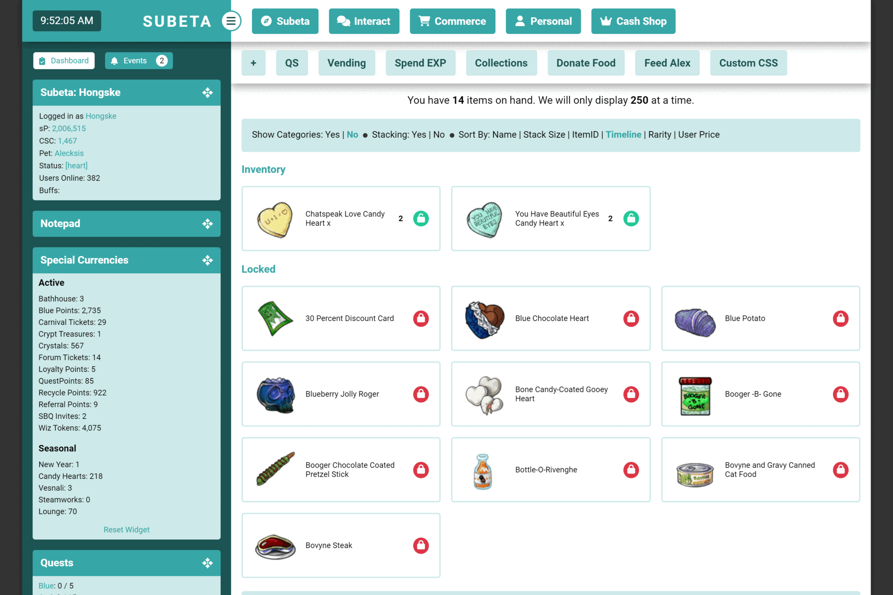

<div style="padding: 1em 1em 0; border: 1px solid #404040; border-radius: 3px; background: #404040; font-style: normal;">

[Home](https://hongske.github.io/subeta/) » **Modernised Theme** • A CustomCSS-theme for desktop and mobile
</div>
<!--------------------------------------------------------------------------------------------------------------------->
<br>
<!--------------------------------------------------------------------------------------------------------------------->



## ⭐ Features
Below features are mostly for both desktop *and* mobile views, but features preceded by 👁‍🗨 are mobile-only!

<details>
<summary>📌 List of general layout changes</summary>

- Modernised the layout
  - Unified various design elements (banners, menu's, buttons, ...)
  - Improved readability of various bits and bobs
  - Upated icons (using FontAwesome 6.5.1)
  - Gave the total layout a max-width, so that it doesn't look so stretched on bigger screens
  - Added mobile version for smartphone users
- Modified main menu-bar
  - Fixed the main menu-bar to the top of the page, so that it's always in view (even if you scroll down)
  - Reversed the order of menu-items
  - Added icons to the menu-items
  - Added options `--number-of-menu-pets`, `--number-of-menu-friends` and `--number-of-menu-shops` so you can chose how many subitems you want to see for these dropdowns at once
  - 👁‍🗨 Modified menu dropdowns so that they're shown in 2 columns
  - 👁‍🗨 Removed text in the menu-items, so that only icons are shown
  - 👁‍🗨 Removed nested dropdowns (e.g. Freinds, Pets, ...)
- Modified bookmarks
  - Fixed the bookmarks-bar to the top of the page instead of the side, underneath the main menu-bar
  - 👁‍🗨 Removed bookmarks
- Modified sidebar
  - Made sidebar wider
  - Moved the time-display to the left and made it bigger
  - Modified the sidebar-toggle so that it's an icon instead of text
  - Restyled sidebar-widgets:
    - Modified sidebar-widgets so they can only be dragged via their icon (instead of by the whole header or widget)
    - Restyled "Active Pet"
    - Restyled "Battle Pet"
      - Added option `--display-sidebar-battlepet-buttons` to hide buttons
      - Emphasised the training center status
    - Restyled "Friend Feed"
    <!-- TODO - Restyled "Melody's Cottage" -->
    - Restyled "Navigation"
    - Restyled "Special Currencies"
      - Added option `--display-sidebar-currency-headers` to hide the headers (Active, Seasonal and Events)
    - Restyled "Shop Search" and "Search Subeta"
    - Restyled "Subscriptions"
    - Restyled "Your Avatar" and "Your Account"
      - Removed headers
      - Snapped the widgets together if you put "Your Avatar" **above** "Your Account"
    - Restyled "The Oracle" and "Coda Caves"
      - Removed headers
      - Snapped the widgets together if you put "The Oracle" **above** "Coda Caves"
      - Snapped the widgets together if you put "Coda Caves" **above** "The Oracle"
- Modified item-views
  - Modified the item orientation so that item-images and -text are shown next to each other (instead of below each other)
  - Modified styling for wishlist-items so that they're more obvious
  - Removed styling for wishlist-items in forum-images and signatures
  - Modified item-hovers so that the text in it will always be shown below the image (if there's one)
  - 👁‍🗨 Moved the item-hovers so that they're always centered on the page
  - 👁‍🗨 Resized item-images so they take up less space
  - 👁‍🗨 Removed options to add and remove from wishlist (as it's hard to get right on mobile)
- Added other general options
  - Added option `--display-floating-item` to hide floating items (like flowers during Survival)
  - Added option `--display-hustler` to hide Hustler-banner
  - Added options to modify theme colours ([see ⭐ Customising the theme](#⭐-customising-the-theme))
</details>
<!--------------------------------------------------------------------------------------------------------------------->
<details>
<summary>📌 List of page changes</summary>

- **Vending**
  - Modified the items so that they're easier to read
  - 👁‍🗨 Changed the image of the vending machine to a big red button
- **Quests**
  - 👁‍🗨 Removed NPC-images
  - Restyled **[main quests](https://subeta.net/quests.php/wizard)**
    - Added option `--display-quest-intro` to hide intro-text
    - Moved the "Quit Quest" button to be further away from "Finish Quest", so you don't click it accidentally (only for desktop!)
  - Restyled **[wizard exchange](https://subeta.net/explore/wizard_exchange.php)**
  - Restyled **[Major Drills' quests](https://subeta.net/explore/major_drills.php)**
  - Restyled **[Shinwa's quests](https://subeta.net/explore/goddess.php)**
- Restyled **[Your Events](https://subeta.net/events.php)**
</details>
<!--------------------------------------------------------------------------------------------------------------------->
<details>
<summary>📌 List of page changes [Commerce]</summary>

- **[Special Shops](https://subeta.net/ss.php)**
  - Restyled overview of shops to match the styling of [Subeta » News » Dailies](https://subeta.net/dailies.php)
  - Restyled [Esther's Shop](https://subeta.net/ss.php/esther#/shop/), [L'Amour Parlor](https://subeta.net/ss.php/louis#/shop/), [Libertine Lounge](https://subeta.net/ss.php/lounge#/shop/), [New Years Shop](https://subeta.net/ss.php/newyears#/shop/), [Steamworks Menagerie](https://subeta.net/ss.php/menagerie#/shop/) and [Zombie Den](https://subeta.net/ss.php/skitters#/shop/)
    - Restyled the items
    - Removed the sidebar with NPC-image, NPC name and buttons
- **[Your Shops](https://subeta.net/user_shops.php/mine)**
  - Restyled **Edit Items**
    - Added option `--display-yourshop-item-category` to hide categories (from the filters *and* items-list)
    - Removed Item ID from the items-list
  - Restyled **Quick Stock**
    - Replaced locations' text with icons
    - Added option `--display-yourshop-quickstock-delete` to hide delete-option completely
    - 👁‍🗨 Removed the delete-option
  - Restyled **Autopricer**
    - Removed info-text about new prices (lowest, average and no change)
    - Removed old price and average price columns from results table, so only lowest price is visible
    - Restyled pricing to emphasise whether a price has gone up or down
  - Restyled **Profits**
    - 👁‍🗨 Removed piggybank-images
  - Restyled **Sales History**
    - Added option `--display-yourshop-sales-info` to hide info-text
</details>
<!--------------------------------------------------------------------------------------------------------------------->
<details>
<summary>📌 List of page changes [Interact]</summary>

- **[Forums](https://subeta.net/forums.php)**
  - Restyled **[Forum Home](https://subeta.net/forums.php)**
    - Added option `--display-forum-pulse` to completely hide forum-pulse
    - Replaced collapse-text with an icon (same icon as for sidebar-widgets)
    - Removed images for forum boards
    - Modified order of forum-details so that the list of subforums is last
    - Restyled **Subforums**
      - Topics with unread posts have their text in bold
      - Topics with unread posts also have a bullhorn icon, which you can click to go the most recent unread post
      - Topics you have replied on have their text in black
      - Topics you haven't replied on have their text in your theme's accent colour
    - Restyled **Topics**
      - Removed user avatars, leashed pets and options to like avatar/post
      - Removed the ping- and report-buttons on own posts
      - Added option `--display-forum-post-report` to hide the report-button on posts
      - Added option `--display-forum-post-image` to hide post images
      - Added option `--display-forum-post-signature` to hide signatures
      - 👁‍🗨 Removed forum images and signatures
      - Fixed reply-form to the bottom of the page, so that it's always visible
      - Fixed the locked-message for locked topics to the bottom of the page, so that it's always visible
      - Fixed the lock-icon on the locked-message for locked topics, so it's less ginormous
      - Removed the ping-options from the reply form
      - 👁‍🗨 Removed the formatting-options from the reply form
  <!-- TODO - Restyled **[Subscribed Threads](https://subeta.net/forums.php/subscriptions)** -->
  <!-- TODO - Restyled **[Recent Topics](https://subeta.net/forums.php/recent/topics)** -->
  <!-- TODO - Restyled **[Recent Posts](https://subeta.net/forums.php/recent/posts)** -->
  <!-- TODO - Restyled **[Groups](https://subeta.net/forums.php/groups/)** -->
  <!-- TODO - Restyled **[Admin Posts](https://subeta.net/forums.php/admin_posts)** -->
  <!-- TODO - Restyled **[Options](https://subeta.net/preferences.php?act=forum)** -->
  <!-- TODO - Restyled **[sCode](https://subeta.net/forums/include/codes.php)** -->
</details>
<!--------------------------------------------------------------------------------------------------------------------->
<details>
<summary>📌 List of page changes [Personal]</summary>

- Restyled **[Account Search](https://subeta.net/isearch.php)**
- Restyled **[Achievements](https://subeta.net/achievements.php)**
  - Removed achievement-counter at the top of the page
  - Resized the sidebar
  - 👁‍🗨 Removed subcategories
- Restyled **Comments**
- Restyled **[Inventory](https://subeta.net/inventory.php)**
  - Added option `--display-inventory-locked` to hide the info-text about locked items
  - Replaced the lock-images with colour-coded icons
  - Restyled the item detail page
- Restyled **[Pets](https://subeta.net/pets.php)**
  - Modified the pet-dropdown with options so that it's always shown
  - Added options to hide individual links in the pet-dropdown ([see the display options for pets](#⭐-customising-the-theme))
  - Added options to change the font-weight of individual links in the pet-dropdown ([see the font-weight options for pets](#⭐-customising-the-theme))
  - Added option `--number-of-pets` to change the number of pet per row
  - Added icons for hunger and happiness
  - Modified icon for likes
- **Vault**
  - Removed "Your Vaults"-text from the menu
  - Restyled **[Currency Storage](https://subeta.net/explore/vaults.php?vault=currency)**
  - Restyled **[Item Storage](https://subeta.net/explore/vaults.php?vault=item)**
    - Removed flavor-image and -text
- Restyled **[Wishlist](https://subeta.net/wishlists.php)**
</details>
<!--------------------------------------------------------------------------------------------------------------------->
<details>
<summary>📌 List of page changes [Subeta]</summary>

- **[Explore » Darkside » Ultimate Pet Zapper](https://subeta.net/explore/zapper.php)**
  - Removed NPC-image
  - Added option `--display-pet-zapper-warning` to hide warning-text
  - Added option `--display-pet-zapper-intro` to hide intro-text
  - Added option `--display-pet-zapper-adoption` to hide adoption-text
- **[Explore » Delphi » Carnival » Ruffie Raffle](https://subeta.net/explore/carnival/ruffie_raffle.php)**
  - 👁‍🗨 Removed NPC-image
- **[Explore » Galaxan Wastes » The Rift](https://subeta.net/explore/rift/)**
  - 👁‍🗨 Removed image
- **[Explore » Shadowglen » Crypts](https://subeta.net/explore/crypts.php)**
  - Made the crypts-map-images scrollable on mobile
  - 👁‍🗨 Removed NPC-image
- **[Explore » Shengui Guo » Floating Market](https://subeta.net/explore/shengui_guo/river.php)**
  - Restyled **[Dara's Darlings](https://subeta.net/explore/shengui_guo/dara.php)**, **[Fine Fabrics](https://subeta.net/explore/shengui_guo/clothing.php)** and **[Fresh and Flavorful](https://subeta.net/explore/shengui_guo/ujin.php)**
    - Added option `--display-shenguiguo-floatingmarket-intro` to collectively hide Dara's, Jogoh's and Ujin's intro-texts
    - Added option `--display-shenguiguo-dara-intro` to individually hide Dara's intro-text
    - Added option `--display-shenguiguo-jogoh-intro` to individually hide Jogoh's intro-text
    - Added option `--display-shenguiguo-ujin-intro` to individually hide Ujin's intro-text
    - 👁‍🗨 Removed NPC-image + intro-text
- **Games**
  - Restyled the games overview-page
- **Games » Battle**
  - Removed images in the menu-bar
  - Restyled **[Spend Exp](https://subeta.net/games/battle/exp.php)**
  - Restyled **[Training Center](https://subeta.net/explore/train.php)**
    - Removed NPC-image
    - Added option `--display-battle-training-intro` to hide intro-text
    - Added option `--display-battle-training-warning` to hide warning about level cap and autotraining
    - Added option `--display-battle-training-auto` to hide autotraining buttons
    - Added option `--number-of-pets-training` to change the number of pet per row
- **[Games » Chance » Fishing](https://subeta.net/games/fishing.php)**
  - 👁‍🗨 Removed NPC-image
- **[Games » Chance » Scratchcards](https://subeta.net/games/scratchcards.php)**
  - 👁‍🗨 Removed NPC-image
- **Games » Collections**
  - Restyled **Plushie**, **Trading Card**, **Beanbag**, **Pumpkin**, **Pastry** and **Tile** collections
  - Restyled **Sticker Album** collection
    - Added option `--display-stickers-unstack` to hide the "unstack" link under stickers
  - Restyled **[Minion Zoo](https://subeta.net/games/minions/index.php)**
    - Removed all gaming options so that it's just a collection
- **[Games » Miscellaneous » Item Hunter](https://subeta.net/games/hunt.php)**
  - Restyled content
  - 👁‍🗨 Removed NPC-image, NPC-name and intro-text
- **[News](https://subeta.net/news.php)**
  - Moved Check Out, Upcoming and Daily to be above the posts (instead of next to them)
  - Added option `--display-news-checkout` to hide Check Out
  - Added option `--display-news-upcoming` to hide Upcoming
  - Added option `--display-news-daily` to hide Daily
  - Added option `--display-news-daily-dailies` to hide Daily » Dailies
  - Added option `--display-news-daily-recycle` to hide Daily » Recycle Beast
  - Added option `--display-news-daily-lottery` to hide Daily » Potion Lottery Winner
  - Removed daily support goal (but only because it doesn't seem to work anymore)
  - Restyled **[Dailies](https://subeta.net/dailies.php)**
- **[Subetapedia](https://subeta.net/subetapedia/)**
  <!-- TODO - Restyle overview (so links all have same style and non-links are removed) -->
  <!-- TODO - Restyle pages -->
</details>

<!--------------------------------------------------------------------------------------------------------------------->
<br>
<!--------------------------------------------------------------------------------------------------------------------->

## ⭐ Installing the theme
To get started, paste the following code into the box on your [CustomCSS page](https://subeta.net/preferences.php?act=customcss):
```css
@import url('https://hongske.github.io/subeta/custom-css/Modernised/theme.css')
```

<!--------------------------------------------------------------------------------------------------------------------->
<br>
<!--------------------------------------------------------------------------------------------------------------------->

## ⭐ Customising the theme
To customise this theme, you'll need to override certain CSS Variables. To do so, you'll need to add the following snippet **after** your `@import` code:
```css
:root {
    /* insert your theme options here */
}
```

Then, add your overrides between the curly brackets. An example would be:
```css
@import url('https://hongske.github.io/subeta/custom-css/Modernised/theme.css');

:root {
    --color-primary: #b4d455;
    --display-floating-item: none;
    --display-battle-training-intro: none;
    --display-battle-training-warning: none;
}
```

You can find the available options in the following parts:

<details>
<summary>🍄 Colour options</summary>

- Variables begin with `--colour` and need a valid CSS colour value
- Examples of valid values are `crimson`, `#DC143C` and `rgb(220, 20, 60)`
- [You can find more info about valid CSS colour values here](https://www.w3schools.com/cssref/css_colors_legal.php)
- These are used to customise the **colours** on the website

| Option            | Info                                        | Default value |
|-------------------|---------------------------------------------|---------------|
| `--color-primary` | Main theme colour                           | `#9BA84F`     |
| `--color-blue`    | Blue colour, used for alerts                | `#0DCAF0`     |
| `--color-green`   | Green colour, used for alerts, buttons, etc | `#20C997`     |
| `--color-red`     | Red colour, used for alerts, buttons, etc   | `#DC3545`     |
| `--color-yellow`  | Yellow colour, used for alerts              | `#FFC107`     |

Below are some examples of accent colours that you can use, which have been extracted from the default Subeta templates.
These are also the colours that are displayed in the opening GIF at the top of this page!
| HEX-code                                              | Theme             |
|-------------------------------------------------------|-------------------|
| `#6FA8BF`<span style="color:#6FA8BF;">&#9632;</span> | Arctic Frost      |
| `#642039`<span style="color:#642039;">&#9632;</span> | Darkside          |
| `#642039`<span style="color:#642039;">&#9632;</span> | Delphi Beach      |
| `#3F8C7E`<span style="color:#3F8C7E;">&#9632;</span> | Masquerade        |
| `#D9A84E`<span style="color:#D9A84E;">&#9632;</span> | Masquerade        |
| `#687E8C`<span style="color:#687E8C;">&#9632;</span> | Riverside Valley  |
| `#33402D`<span style="color:#33402D;">&#9632;</span> | Shadowglen        |
| `#63494F`<span style="color:#63494F;">&#9632;</span> | Shadowglen        |
</details>
<!--------------------------------------------------------------------------------------------------------------------->
<details>

<summary>🍄 Display options</summary>

- Variables begin with `--display` and need a valid CSS display value
- Examples of valid values are `none`, `block` and `flex`
- [You can find more info about valid CSS display values here](https://www.w3schools.com/cssref/pr_class_display.php)
- These are used to **hide** certain parts of the website, **which can be done by changing the value to `none`**

| Options                                       | Info ❗❗ Use `none` as a value to hide these things ❗❗                                 |
|-----------------------------------------------|---------------------------------------------------------------------------------------|
| `--display-floating-item`                     | General » Hide floating items (like flowers during survival)                          |
| `--display-hustler`                           | General » Hide Hustler-banner                                                         |
| `--display-sidebar-battlepet-buttons`         | General » Sidebar » Hide buttons for battlepet widget                                 |
| `--display-sidebar-currency-headers`          | General » Sidebar » Hide the headers (Active, Seasonal, Events) for currencies-widget |
| `--display-yourshop-item-category`            | Commerce » Your Shops » Edit Items » Hide categories-options                          |
| `--display-yourshop-quickstock-delete`        | Commerce » Your Shops » Quick Stock » Hide delete-option                              |
| `--display-yourshop-sales-info`               | Commerce » Your Shops » Sales History » Hide info-text                                |
| `--display-forum-post-image`                  | Interact » Forums » Hide post images                                                  |
| `--display-forum-post-signature`              | Interact » Forums » Hide signatures                                                   |
| `--display-forum-post-report`                 | Interact » Forums » Hide the report-button on posts                                   |
| `--display-forum-pulse`                       | Interact » Forums » Home » Hide forum pulse                                           |
| `--display-inventory-locked`                  | Personal » Inventory » Hide info-text about locked items                              |
| `--display-pet-option-description`            | Personal » Pets » Dropdown » Hide option "Edit Description"                           |
| `--display-pet-option-headshot`               | Personal » Pets » Dropdown » Hide option "Edit Headshot"                              |
| `--display-pet-option-name`                   | Personal » Pets » Dropdown » Hide option "Change Name"                                |
| `--display-pet-option-case`                   | Personal » Pets » Dropdown » Hide option "Change Case"                                |
| `--display-pet-option-friends`                | Personal » Pets » Dropdown » Hide option "Friends"                                    |
| `--display-pet-option-profile`                | Personal » Pets » Dropdown » Hide option "View Profile"                               |
| `--display-pet-option-books`                  | Personal » Pets » Dropdown » Hide option "Books Read"                                 |
| `--display-pet-option-food`                   | Personal » Pets » Dropdown » Hide option "Food Eaten"                                 |
| `--display-pet-option-train`                  | Personal » Pets » Dropdown » Hide option "Train"                                      |
| `--display-pet-option-heal`                   | Personal » Pets » Dropdown » Hide option "Heal"                                       |
| `--display-pet-option-scrolls`                | Personal » Pets » Dropdown » Hide option "Scrolls"                                    |
| `--display-pet-option-treasure`               | Personal » Pets » Dropdown » Hide option "Treasure (x / xx)"                          |
| `--display-pet-option-tcmass`                 | Personal » Pets » Dropdown » Hide option "TC Mass Add"                                |
| `--display-pet-option-abandon`                | Personal » Pets » Dropdown » Hide option "Abandon"                                    |
| `--display-pet-option-give`                   | Personal » Pets » Dropdown » Hide option "Give to Friend"                             |
| `--display-quest-intro`                       | Quests » Hide intro-text                                                              |
| `--display-pet-zapper-adoption`               | Subeta » Explore » Darkside » Ultimate Pet Zapper » Hide adoption-text                |
| `--display-pet-zapper-intro`                  | Subeta » Explore » Darkside » Ultimate Pet Zapper » Hide intro-text                   |
| `--display-pet-zapper-warning`                | Subeta » Explore » Darkside » Ultimate Pet Zapper » Hide warning-text                 |
| `--display-shenguiguo-floatingmarket-intro`   | Subeta » Explore » Shengui Guo » Floating Market » Hide intro-text for all 3 shops    |
| `--display-shenguiguo-dara-intro`             | Subeta » Explore » Shengui Guo » Floating Market » Hide Dara's intro-text             |
| `--display-shenguiguo-jogoh-intro`            | Subeta » Explore » Shengui Guo » Floating Market » Hide Jogoh's intro-text            |
| `--display-shenguiguo-ujin-intro`             | Subeta » Explore » Shengui Guo » Floating Market » Hide Ujin's intro-text             |
| `--display-battle-training-auto`              | Subeta » Games » Battle » Training Center » Hide autotraining buttons                 |
| `--display-battle-training-intro`             | Subeta » Games » Battle » Training Center » Hide intro-text                           |
| `--display-battle-training-warning`           | Subeta » Games » Battle » Training Center » Hide warning-text                         |
| `--display-stickers-unstack`                  | Subeta » Games » Collections » Sticker Album » Hide "unstack" link under stickers     |
| `--display-news-checkout`                     | Subeta » News » Hide Check Out                                                        |
| `--display-news-upcoming`                     | Subeta » News » Hide Upcoming                                                         |
| `--display-news-daily`                        | Subeta » News » Hide Daily                                                            |
| `--display-news-daily-dailies`                | Subeta » News » Hide Daily » Dailies                                                  |
| `--display-news-daily-recycle`                | Subeta » News » Hide Daily » Recycle Beast                                            |
| `--display-news-daily-lottery`                | Subeta » News » Hide Daily » Potion Lottery Winner                                    |
</details>
<!--------------------------------------------------------------------------------------------------------------------->
<details>
<summary>🍄 Number options</summary>

- Variables begin with `--number-of` and need a valid number
- Examples of valid values are `1`, `10`, `0.1` and `.1`
- Examples of **non**-valid values are `0,1`, `,1` and anything containing letters of the alphabet
- These are used to customise the **number of items** that are shown

| Options                      | Info                                                       | Default value |
|------------------------------|------------------------------------------------------------|---------------|
| `--number-of-menu-friends`   | General » Menu » How many friends should be shown at once? | `10`          |
| `--number-of-menu-pets`      | General » Menu » How many pets should be shown at once?    | `10`          |
| `--number-of-menu-shops`     | General » Menu » How many shops should be shown at once?   | `10`          |
</details>
<!--------------------------------------------------------------------------------------------------------------------->
<details>
<summary>🍄 Font-weight options</summary>

- Variables begin with `--fontweight` and need a valid CSS font-weight value
- Examples of valid values are `normal`, `bold`, `400` and `700`
- [You can find more info about valid CSS font-weight values here](https://www.w3schools.com/cssref/pr_font_weight.php)
- These are used to customise the **font weight** of certain things, e.g. if certain things should be in bold

| Options                               | Info                                                                      |
|---------------------------------------|---------------------------------------------------------------------------|
| `--fontweight-pet-option-description` | Personal » Pets » Dropdown » Font weight for option "Edit Description"    |
| `--fontweight-pet-option-headshot`    | Personal » Pets » Dropdown » Font weight for option "Edit Headshot"       |
| `--fontweight-pet-option-name`        | Personal » Pets » Dropdown » Font weight for option "Change Name"         |
| `--fontweight-pet-option-case`        | Personal » Pets » Dropdown » Font weight for option "Change Case"         |
| `--fontweight-pet-option-friends`     | Personal » Pets » Dropdown » Font weight for option "Friends"             |
| `--fontweight-pet-option-profile`     | Personal » Pets » Dropdown » Font weight for option "View Profile"        |
| `--fontweight-pet-option-books`       | Personal » Pets » Dropdown » Font weight for option "Books Read"          |
| `--fontweight-pet-option-food`        | Personal » Pets » Dropdown » Font weight for option "Food Eaten"          |
| `--fontweight-pet-option-train`       | Personal » Pets » Dropdown » Font weight for option "Train"               |
| `--fontweight-pet-option-heal`        | Personal » Pets » Dropdown » Font weight for option "Heal"                |
| `--fontweight-pet-option-scolls`      | Personal » Pets » Dropdown » Font weight for option "Scrolls"             |
| `--fontweight-pet-option-treasure`    | Personal » Pets » Dropdown » Font weight for option "Treasure (x / xx)"   |
| `--fontweight-pet-option-tcmass`      | Personal » Pets » Dropdown » Font weight for option "TC Mass Add"         |
| `--fontweight-pet-option-abandon`     | Personal » Pets » Dropdown » Font weight for option "Abandon"             |
| `--fontweight-pet-option-give`        | Personal » Pets » Dropdown » Font weight for option "Give to Friend"      |
</details>
<!--------------------------------------------------------------------------------------------------------------------->
<details>
<summary>🍄 Special options</summary>

- These variables have been isolated into their own bit at the end of this section
- Each variable uses another CSS variable as value, e.g. `--number-of-pets: var(--col-3)`
- These are used for more advanced bits

<table>
<thead>
    <tr>
        <th>Special options</th>
        <th>❗❗ These options use other CSS variables as value ❗❗</th>
    </tr>
</thead>
<tbody>
    <tr>
        <td><code>--number-of-pets</code></td>
        <td>
            <ul>
                <li>
                    <b>Personal » Pets</b>
                    » Number of pets per row, with each pet being 1 column
                </li>
                <li>
                    <b>Valid values</b> are
                    <code>var(--col-1)</code>, <code>var(--col-2)</code>, <code>var(--col-3)</code>, <code>var(--col-4)</code> and <code>var(--col-5)</code>
                </li>
                <li>
                    <b>Default value</b> is <code>var(--col-3)</code>, which means 3 columns or 3 pets per row
                </li>
            </ul>
        </td>
    </tr>
    <tr>
        <td><code>--number-of-pets-training</code></td>
        <td>
            <ul>
                <li>
                    <b>Subeta » Games » Battle » Training Center</b>
                    » Number of pets per row, with each pet being 1 column
                </li>
                <li>
                    <b>Valid values</b> are
                    <code>var(--col-1)</code>, <code>var(--col-2)</code>, <code>var(--col-3)</code>, <code>var(--col-4)</code> and <code>var(--col-5)</code>
                </li>
                <li>
                    <b>Default value</b> is <code>var(--number-of-pets)</code>, which means the default is the same as whatever has been set for the number of pets on the Pets-page
                </li>
            </ul>
        </td>
    </tr>
</tbody>
</table>

</details>

<!-- TODO - Write a script to auto-generate needed import & :root-code, based on checkboxes -->

<!--------------------------------------------------------------------------------------------------------------------->
<br>
<!--------------------------------------------------------------------------------------------------------------------->

## ⭐ Credits
- [spacemage](https://subeta.net/users/spacemage), for their [year indicators for yearly event shops](https://subeta.net/forums.php/gotopost/66366953)
- [Sorcerer](https://subeta.net/users/Sorcerer), for their [very helpful collection of Custom CSS](https://karlpiper.com/subeta/customcss/)
- Icons by [FontAwesome](https://fontawesome.com/)
- Roboto font by [Google Fonts](https://fonts.google.com/specimen/Roboto)

<!--------------------------------------------------------------------------------------------------------------------->
<br>
<!--------------------------------------------------------------------------------------------------------------------->

## ⭐ Changelog
<strong>📅 2024/03/01</strong>

- Added styling for minions to the [Pets-page](https://subeta.net/pets.php)
- Fixed bookmark styling on the "Search Subeta" page (default styling had them all in italics)
- Fixed margin on the "Achievement Unlocked" message, when it appears in the main portion of the page
- Updated styling on item detail-page in [Inventory](https://subeta.net/inventory.php)
- Updated styling for sidebar-widgets
  - Restyled "Coda Caves" and "The Oracle" widgets
    - Removed headers
    - Snapped the widgets together if you put "The Oracle" **above** "Coda Caves"
    - Snapped the widgets together if you put "Coda Caves" **above** "The Oracle"
  - Updated "Special Currencies" widget
    - Added option `--display-sidebar-currency-headers` to hide the headers (Active, Seasonal and Events) for "Active Currencies"
- Updated styling on the "+ wishlist" and "- wishlist" hovers to add and remove items from your wishlist

<br>
<details>
<summary>📅 2024/02/29</summary>

- Added option `--display-inventory-locked` to hide the info-text about locked items in [Inventory](https://subeta.net/inventory.php)
- Added option `--display-stickers-unstack` to hide the "unstack" link under stickers in the [Sticker Album](https://subeta.net/games/stickers.php)
- Added options to hide individual links in the pet-dropdown ([see the display options for pets](#⭐-customising-the-theme))
- Added options to change the font-weight of individual links in the pet-dropdown ([see the font-weight options for pets](#⭐-customising-the-theme))
- Added special options to change the number of pets shown on the [Pets-page](https://subeta.net/pets.php) and in the [Training Center](https://subeta.net/explore/train.php)
- Fixed biting in forums (now you can only click the link if it says "Bite!")
- Fixed the "new announcement" banner so the links are bold and removed the "close" link
- Updated styling for categories on [Wishlist](https://subeta.net/wishlists.php)
- Updated styling on item detail-page in [Inventory](https://subeta.net/inventory.php)
- Updated year indicators for yearly event shops
</details>
<!--------------------------------------------------------------------------------------------------------------------->
<details>
<summary>📅 2024/02/28</summary>

- Added option `--display-quest-intro` to hide intro-text of main quests
- Added option `--display-yourshop-quickstock-delete` to hide delete-option completely in quick stock
- Added options to hide the intro-texts for the 3 interactive shops on the [Floating Market](https://subeta.net/explore/shengui_guo/river.php):
    - Added option `--display-shenguiguo-floatingmarket-intro` to collectively hide Dara's, Jogoh's and Ujin's intro-texts
    - Added option `--display-shenguiguo-dara-intro` to individually hide Dara's intro-text
    - Added option `--display-shenguiguo-jogoh-intro` to individually hide Jogoh's intro-text
    - Added option `--display-shenguiguo-ujin-intro` to individually hide Ujin's intro-text
- Added options to hide the boxes on the [News](https://subeta.net/news.php):
  - Added option `--display-news-checkout` to hide Check Out
  - Added option `--display-news-upcoming` to hide Upcoming
  - Added option `--display-news-daily` to hide Daily
  - Added option `--display-news-daily-dailies` to hide Daily » Dailies
  - Added option `--display-news-daily-recycle` to hide Daily » Recycle Beast
  - Added option `--display-news-daily-lottery` to hide Daily » Potion Lottery Winner
- Added styling for [buffs](https://subeta.net/preferences.php?act=buffs)
- Added styling for Hidden Opponent alerts (based on the one from Item Hunt)
- Fixed link colours in forum signatures, so that they're the same as the rest of the signature text
- Removed Chase's image and name on mobile in [Item Hunter](https://subeta.net/games/hunt.php)
- Updated year indicators for yearly event shops
</details>
<!--------------------------------------------------------------------------------------------------------------------->
<details>
<summary>📅 2024/02/27</summary>

- Moved menu-item's dropdown in the main menu-bar to the side of the menu-items
- Added options `--number-of-menu-pets`, `--number-of-menu-friends` and `--number-of-menu-shops` so you can pick how many items you want to see in the menu's
- Added styling for [the spend exp page](https://subeta.net/games/battle/exp.php)
- Added styling for [the rift](https://subeta.net/explore/rift/)
- Added option `--display-forum-post-report` to hide report-button on posts
- Added styling for shop-related random events (Morty or discount card)
- Updated styling for comments (mainly reordered things a bit in the individual comments)
</details>
<!--------------------------------------------------------------------------------------------------------------------->
<details>
<summary>📅 2024/02/26</summary>

- Rewrote the page-specific section, for easier expansion considering the design patterns on the current Subeta website
- Added option `--display-battle-training-intro` to hide Jim's intro-text in the Training Center
- Added option `--display-battle-training-warning` to hide Jim's warning about level cap and autotraining at the Training Center
- Added option `--display-battle-training-auto` to hide autotraining options at the Training Center
- Added option `--display-forum-pulse` to completely hide forum-pulse at the Forums
- Added option `--display-forum-post-image` to hide forum images in posts at the Forums
- Added option `--display-forum-post-signature` to hide signatures in posts at the Forums
- Added option `--display-pet-zapper-warning` to hide warning about the pet zapper at the Ultimate Pet Zapper
- Added option `--display-pet-zapper-intro` to hide Euclid's intro-text at the Ultimate Pet Zapper
- Added option `--display-pet-zapper-adoption` to hide message about adopting a Qrykee or Yaherra at the Ultimate Pet Zapper
- Added option `--display-yourshop-item-category` to hide category-search (in both the filter- and item-list) for Your Shop » Edit Items
- Added option `--display-yourshop-sales-info` to hide info-text for Your Shop » Sales History
</details>
<!--------------------------------------------------------------------------------------------------------------------->
<details>
<summary>📅 2024/02/25</summary>

- Added extra styling for sidebar-widgets, inspired by [the Widget Overhaul](https://karlpiper.com/subeta/customcss/#Overhaul-All-Widgets) that [Sorcerer](https://subeta.net/users/Sorcerer) made
- Added option `--display-sidebar-battlepet-buttons` to hide battlepet buttons in the sidebar, again inspired by Sorcerer's Widget Overhaul (see link above)
- Added minor layout tweaks for Ruffie Raffle, after you get a doll (mostly mobile)
- Fixed spacing for the Ruffie Raffle buttons, after you get a doll
</details>
<!--------------------------------------------------------------------------------------------------------------------->
<details>
<summary>📅 2024/02/24</summary>

- Added styling for [the special shops page](https://subeta.net/ss.php)
- Added button-styles for the link back to Shinwa on quest-pages (after finishing the quest)
- Fixed sidebar toggling so that content correctly displays over the whole page when you hide sidebar
- Fixed events counter in the sidebar, so that it overflows correctly
- Fixed click-area for floating items so that it's limited to the item itself
</details>
<!--------------------------------------------------------------------------------------------------------------------->
<details>
<summary>📅 2024/02/23</summary>

- Initial commit (rewrite of the original theme)
</details>
