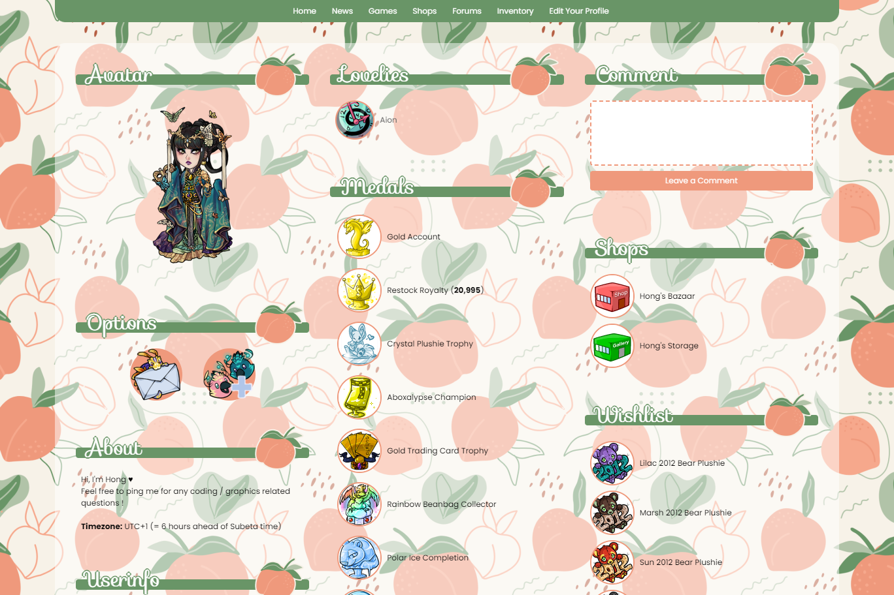
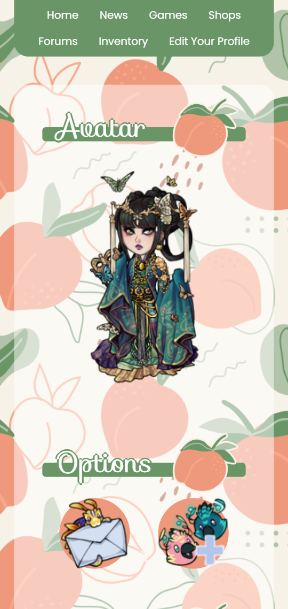

<div style="padding: 1em 1em 0; border: 1px solid #404040; border-radius: 3px; background: #404040; font-style: normal;">

[Home](https://hongske.github.io/subeta/) » [User Profiles](https://hongske.github.io/subeta/user-profiles) » **Apricot**
</div>

<br>

<table style='border: 0; width: auto; margin: 0 auto;'>
    <tr style='border: 0;'>
        <td valign='top' style='border: 0;'>
            
        </td>
        <td valign='top' style='border: 0;'>
            
        </td>
    </tr>
</table>

<br>

## ⭐ Installing the theme
To install the theme, go to [your profile settings](https://subeta.net/preferences.php?act=profile) and paste the below code into the box:
```
<style>@import url('//hongske.github.io/subeta/user-profiles/Apricot/theme.css');</style>
```

That's all there is to it! Feel free to look at the code and mess around with the variables.

<br>

## ⭐ Credits
- [Poppins font from Google Fonts](https://fonts.google.com/specimen/Poppins)
- [Sofia font from Google Fonts](https://fonts.google.com/specimen/Sofia)
- [Background pattern and header icon from Freepik](https://www.freepik.com/free-vector/hand-drawn-peach-pattern_14308320.htm)

<br>

## ⭐ Changelog
- <strong>2024/07/31</strong>
  - Initial setup