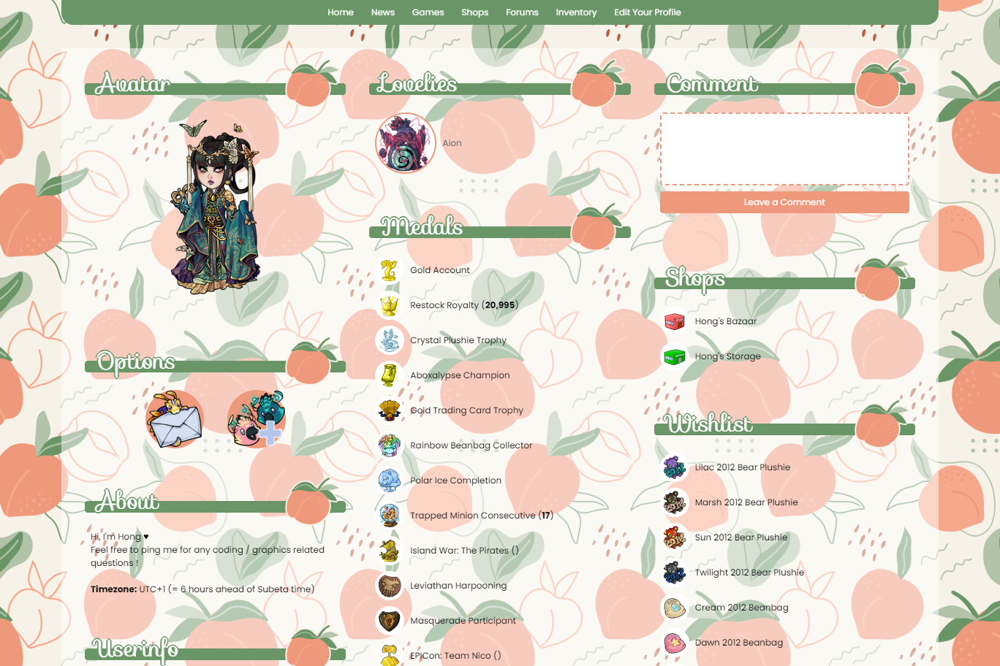

<div style="padding: 1em 1em 0; border: 1px solid #404040; border-radius: 3px; background: #404040; font-style: normal;">

[Home](https://hongske.github.io/subeta/) » [User Profiles](https://hongske.github.io/subeta/user-profiles) » **Apricot**
</div>

<br>

<table>
    <tr>
        <td valign='top'>
            
        </td>
        <td valign='top'>
            
        </td>
    </tr>
</table>

<br>

## ⭐ Installing the theme
To install the theme, go to [your profile settings](https://subeta.net/preferences.php?act=profile) and paste the below code into the box:
```
<style>@import url('//hongske.github.io/subeta/user-profiles/Apricot/theme.css');</style>
```

That's about it! Feel free to look at the code and mess around with the variables.